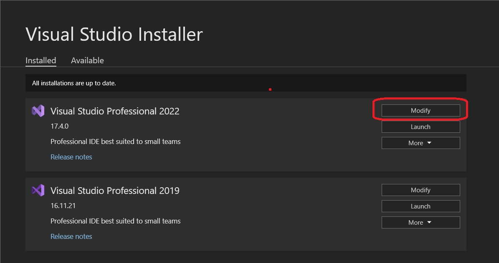
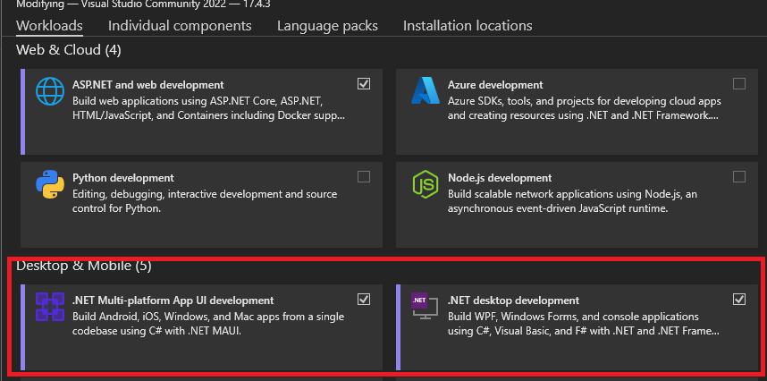
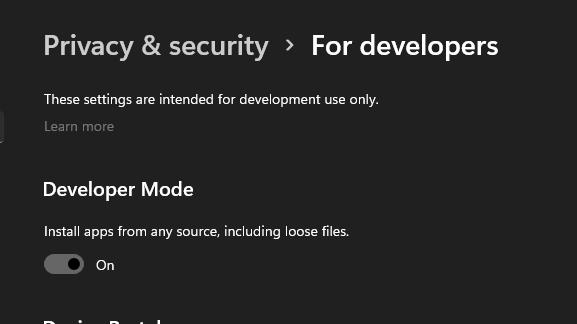

# DMPowerTools

Playground to learn Maui/Blazor.  Goal is to create helpful tools for tabletop DMs
DM Power Tools is a Maui application with the hope to alleviate some hassle with managing combat for a DM.

The Creatures can be imported from [Tetra-Cube Statblocks](https://tetra-cube.com/dnd/dnd-statblock.html) and managed internally.

# Getting Started

Ensure you've installed all necessary prerequisites before running the project. When running locally, it's recommended to use the `Windows Machine` profile.s 

## Prerequisites
- Windows 10/11
- .NET 7 SDK
- The latest Visual Studio version
  - If you don't have the latest version you may run into various errors about missing files for android, ios, etc..
- Maui workload
  - Open the _Visual Studio Installer_ application by searching your installed programs.
  - Modify your Visual Studio installation.
    
  - Under the _Workloads_ tab install the _.NET Maui platform App UI Development_ **and** the _.NET Desktop Environment_ workloads.
    
- In Windows, search for _Privacy & security_ and turn `Developer Mode` to _On_.
  